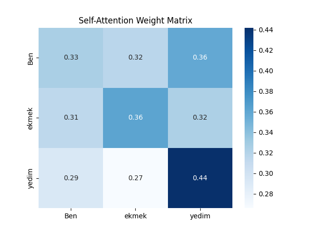
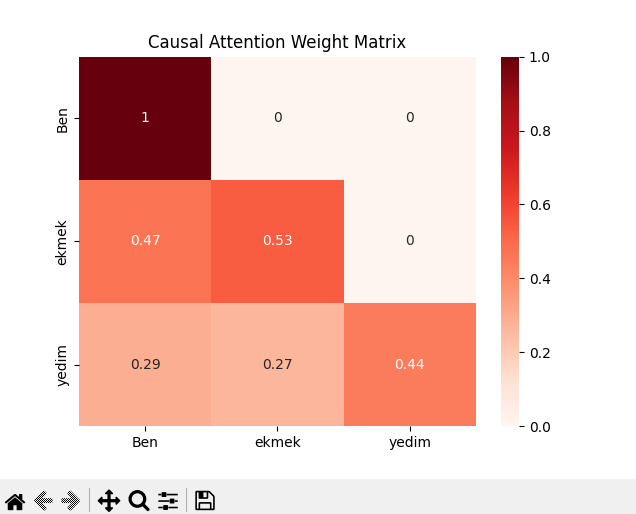
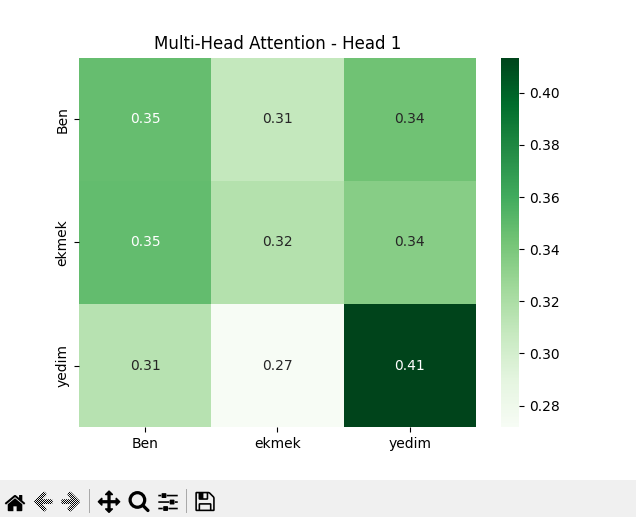
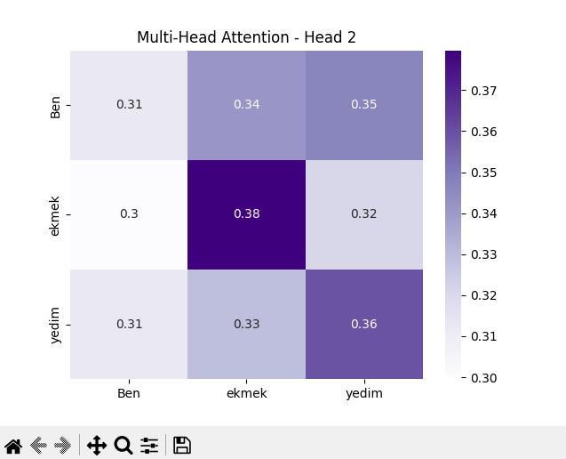

# 🔍 Attention Mekanizmasının Görselleştirmesi
## 📌 İçerik

- Self-Attention mekanizması
- Causal (Nedensel) Attention
- Multi-Head Attention (2 başlıkla)
- Görselleştirme: Heatmap ile ağırlık matrisleri

## 🧠 Kullanılan Yöntemler

### 1. Self-Attention
Token vektörlerinin kendi aralarında benzerliğini ölçer ve her bir token’ın diğer token’larla olan bağını değerlendirir.

### 2. Causal Attention
Dil modeli gibi sıraya duyarlı yapılarda kullanılır. Her token sadece kendisinden önceki ve kendisiyle olan ilişkilere bakar.

### 3. Multi-Head Attention
Vektörü farklı başlıklara bölerek her birinin farklı perspektiflerden ilişkileri öğrenmesini sağlar.

## 📊 Örnek Görselleştirmeler

### 🎯 Self-Attention Ağırlık Matrisi
Token'lar arası dikkat dağılımı:



### ⏳ Causal Attention Ağırlık Matrisi
Sıra bilgisine duyarlı dikkat dağılımı:



### 🧩 Multi-Head Attention
Her bir head için farklı dikkat örüntüleri:

**Head 1**  


**Head 2**  


## 🛠️ Kurulum ve Kullanım

1. Gerekli kütüphaneleri yükleyin:
```bash
pip install numpy matplotlib seaborn
```

2. Python dosyasını çalıştırın:

```bash
python attention.py
```
## 🤖 Katkı
Bu proje, dikkat mekanizmalarını öğrenmek isteyen öğrenciler ve araştırmacılar için bir öğretici araçtır. Katkıda bulunmak isterseniz PR gönderebilirsiniz.
